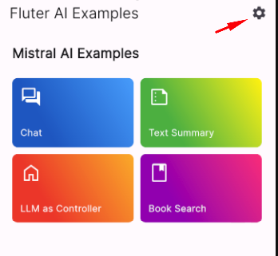

# Flutter AI Examples

Example app showcasing different usages of AI models.

## List of examples

Examples using [Mistral AI API](https://docs.mistral.ai/) through the [MistralAI Client for Dart](https://pub.dev/packages/mistralai_client_dart) package:

- [Simple chat](lib/mistral_ai_chat_example/README.md)
- [Text summary](lib/mistral_ai_summary_example/README.md)
- [Book search](lib/mistral_ai_book_search_example/README.md)
- [LLM as a controller](lib/mistral_ai_llm_controller_example/README.md)

### Interactive Demo

Experience the capabilities of our AI examples live with our interactive demo. This demo allows you to explore the functionality of each example in real time through a web-based interface.

[Launch Interactive Demo](https://flutter-ai-examples.web.app/)

To access the interactive demo, a Mistral AI API key is necessary. If you haven't acquired one yet, please [sign up for a Mistral AI account](https://mistral.ai/) and obtain your API key.

## Getting Started

### Install dependencies

```shell
flutter pub get
```

### Generate code

```shell
dart run build_runner build -d 
```

### Setup Mistral AI API key

#### Using environment variables

1. Open the `env.env` file in the root project
2. Replace `your api key` with your Mistral AI API key.

:warning: This method is required if you want to change a book in the [book search example](lib/mistral_ai_book_search_example/README.md).

#### Using the app settings

It's possible to change the key at runtime in the app settings.

[](docs/assets/app_settings_navigation.png)

### Run the example app

#### Using the Visual Studio Code

We've prepared some ready to use [launch configurations](.vscode/launch.json) for VSC.

In most cases, you should choose the `Run app (debug mode)` configuration.

#### Using the terminal

You can either use the `flutter run` command directly

```shell
flutter run --dart-define-from-file=env.env
```

or use a script that contains the above snippet

##### Linux/MacOS

```shell
./tool/flutter_run.sh
```

##### Windows

```shell
tool\flutter_run.bat
```

You can pass parameters to the script by appending them at the end like this:

```shell
// Linux/MacOS
./tool/flutter_run.sh -d chrome

// Windows
tool\flutter_run.bat -d chrome
```
