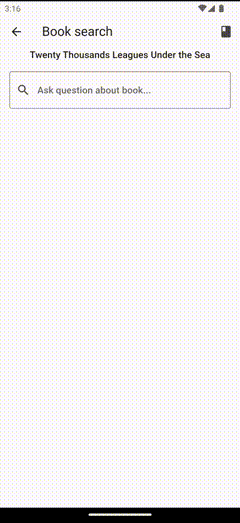

# Book search example

This example showcase how to use [mistral_ai_client_dart](https://pub.dev/packages/mistralai_client_dart) to get answers about book.

Features:

- search for answers about book
- use AI chatbot to extract keywords from question
- see book fragments that are used to get answer
- see all book fragments generated from book

[](../../docs/assets/mistralai_book_search_example.gif)

## How the search data look like?

This example is using `Twenty Thousand Leagues under the Sea` by Jules Verne book. Downloaded from [Project Gutenberg](https://www.gutenberg.org/ebooks/164).

Based on the book text we generated a [json file](../../assets/20k_leages_under_the_sea_verne.json) with embeddings and tokenized fragments of text.

Format of file is (snippet just showcases the structure, not the actual data):

```json
{
    "fragments":[
        "fragment1",
        "fragment2"
    ],
    "fragmentTokens":[
        [1,2,3,4],
        [2,3,4,5],
        [6,7,8,9]
    ],
    "fragmentEmbeddings":[
        [1.0, 2.3, 46.6],
        [21.0, 23.1, 46.6],
        [1.0, 2.3, 46.6],
    ]
}
```

To get tokens and embeddings for first fragment you need to use `fragmentTokens[0]` and `fragmentEmbeddings[0]`.

The tokens are generated with [mistral tokenizer](../mistral_tokenizer/mistral_tokenizer.dart) - port of [js implementation](https://github.com/imoneoi/mistral-tokenizer).
Embeddings are generated with help of Mistral API through [MistralAI Client Dart](https://pub.dev/packages/mistralai_client_dart) package.

To generate new data check [How to use different book?](#how-to-use-different-book) section.

### Book fragments

Book fragments are generated by splitting book into fragments of max 1000 characters where each fragment overlaps with previous one by 100 characters.

Overlap is used to make sure that we don't break sentence in half where some words are in one fragment and some in other.

Around 1000 characters long fragments gives us around 200-300 tokens per fragment.

Split is done using [LangChain.dart](https://pub.dev/packages/langchain) package.

## How to use different book?

To use different the book you need to:

- add your book in `.txt` to [assets](../../assets) folder
- run [prepare data script](prepare_data.dart) with your book name (check class comments on how to run it)
  - this will generate new data for your book in [assets](../../assets) folder
  - generated file will be named `your_book_name.json` if your book file is `your_book_name.txt`
- update [BookSearch](book_search.dart) with your book information
  - change `bookTitle` property to your book title
  - change `bookSearchDataAssetPath` property to your book data generated book data json file

## How answering works?

The answering is done in few steps:

1. Ask AI chatbot to extract keywords from question
2. Get embeddings for question
3. Get embeddings for book fragments (precomputed and stored in [assets](../../assets) folder)
   1. for each fragment get similarity to question (using cosine similarity)
4. Find 5 most similar fragments to question
5. Ask AI chatbot for answer using the most similar fragment and question
6. Display answer to user

### Prompts

To get better answers we are using prompts to help AI chatbot understand what we are looking for.

First prompt is used to extract keywords from question. It is used to help AI chatbot understand what we are looking for. It also specifies what is the expected format of keywords.

prompt:

```dart
'''
You are a helpful assistant designed to create keywords from a question.
The keywords are used to search for the answer in the book.
Return the keywords in a list of strings: ["keyword1", "keyword2", ...]
Do not return anything else than list. 
Do not explain anything.
'''
```

Let's break it down:

- `You are a helpful assistant designed to create keywords from a question. The keywords are used to search for the answer in the book.` - this is used to help AI chatbot understand what we are looking for
- `Return the keywords in a list of strings: ["keyword1", "keyword2", ...]` - this is used to help AI chatbot understand what is the expected format of keywords in form of JSON list
- `Do not return anything else than list.` - Many times AI chatbot will try to return some additional information that is not needed. We try to add more context to output to make sure we get only what we need. Ofc this is not always working as expected. And we still are use regex to extract keywords from the output.
- `Do not explain anything.` - this is used to make sure that AI chatbot will not explain anything (this happens sometimes when AI chatbot is not sure about the answer)

Important thing to note is that we are not specifying what is the book title. We are only specifying that we are looking for keywords from question about some book.
This is not to give AI chatbot any hints about the book title and to make sure that it will not use book title to generate keywords.
Focus here is put on the question about the book, not the book itself.

Second prompt is used to get answer about the book based on keywords, question and book fragments.

prompt:

```dart
'''
You are a helpful assistant designed to answer questions from a book.
You are given list of book fragments related to the question.
Use knowledge only from given fragments to answer the question.
Here are some keywords related to question: ${keywordsFromQuestion.join(', ')}.
Return the answer as a plain text.
'''
```

Let's break it down:

- `You are a helpful assistant designed to answer questions from a book.` - this is used to help AI chatbot understand what we are looking for
- `You are given list of book fragments related to the question.` - this is used to help AI chatbot understand what is the input
- `Use knowledge only from given fragments to answer the question.` - this is used to help AI chatbot understand how to use the input to get the answer and prevent it from using any other knowledge (trained data).
- `Here are some keywords related to question: ${keywordsFromQuestion.join(', ')}.` - this is used to add additional context to AI chatbot about keywords that are related to question. Keywords were used to calculate similarity between question and book fragments

### Problems encountered

- AI chatbot is not always returning keywords in the format we expect
  - we are using regex to extract keywords from the output
  - similar problem would happen if we would like to have an answer in a specific format
- AI chatbot is not always returning the answer
  - here problem is about how big are the fragments that we are passing to AI chatbot
  - how we are splitting the book into fragments
    - fragments may be split in a wrong place which disrupts the meaning of the sentence
    - embedding of a fragment is not representing the whole fragment well:
      - fragments may be too short to contain the answer
      - fragments may be too long to contain the answer
  - Book doesn't contain the answer or the answer is really indirect (mentioned once in the book, not directly answering the question):
    - AI chatbot can't answer the question if the answer is not in the book like:
      - `Who is the author of the book?` - It's mentioned only once in the book
      - `When was the book published?` - It's not mentioned in the book

### How to improve answers?

Example is generating answers in a way described in [How answering works?](#how-answering-works) section.
For sure there are things that could improve how AI is answering the questions below are few ideas that could be tried out:

- pass more fragments from book to AI chatbot
- split book differently into fragments
  - you can try to split book into fragments of different length
  - you can try to split book into fragments that don't overlap
  - you can try to split book into fragments that overlap more
- add metadata about book to AI chatbot like author, year of publishing, genre
